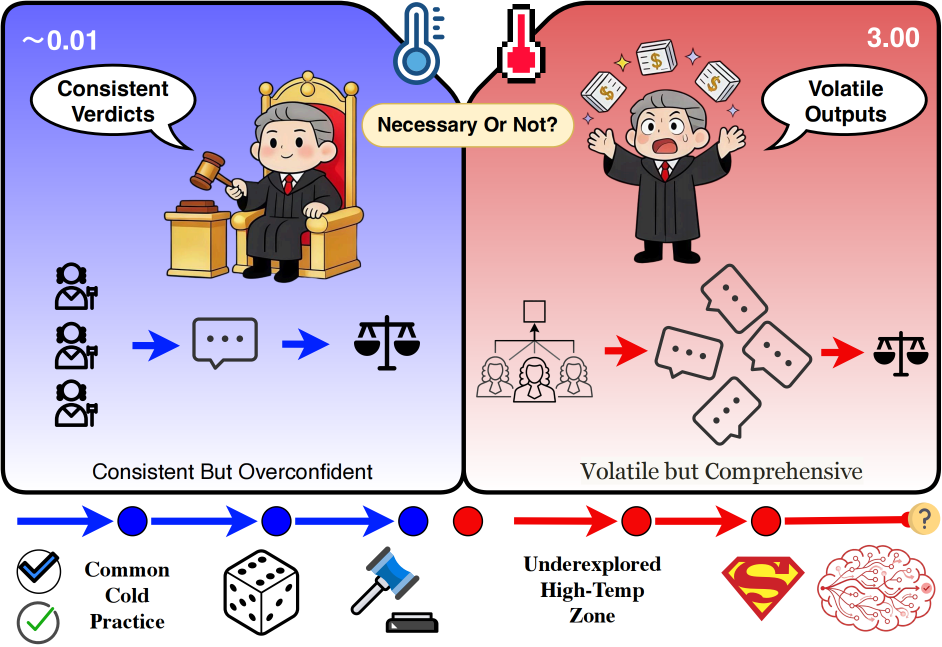

# LLMJudgeTemp

This is the double-blind anonymous repository for the paper **"The Necessity of Setting Temperature in LLM-as-a-Judge"**.

## Abstract

Using large language models (LLMs) as judges to evaluate model outputs has become an important paradigm for automated evaluation. However, in LLM-as-a-Judge settings, the decoding temperature is still typically chosen empirically, with limited systematic evidence regarding its impact. To address this gap, this work presents a systematic study of how temperature influences judgment behavior across different LLM judge models, prompting strategies, and evaluation paradigms. The results show that higher temperatures generally reduce judgment consistency and increase formatting errors, while also revealing latent uncertainty that is often suppressed under low-temperature decoding, especially in ambiguous cases. Further analysis suggests that higher temperatures can serve as an exploratory mechanism and may improve judging performance in complex or uncertain evaluation scenarios. Overall, low-temperature settings are better suited to tasks that prioritize stability and reproducibility, whereas higher-temperature settings are more appropriate for scenarios with substantial ambiguity or complexity, where exploring the judge's decision space is beneficial. These findings suggest that, in LLM-as-a-Judge systems, temperature should be treated not as a fixed hyperparameter but as a controllable, task-dependent design choice that mediates the trade-off between reliability and exploration.

Lightweight framework for testing how decoding temperature changes LLM-as-a-Judge behavior.

## Links

- Dataset: https://huggingface.co/datasets/Volavion/eval_temperatures_bench
- Upstream benchmark: https://huggingface.co/datasets/lmsys/mt_bench_human_judgments

## Install

~~~bash
cd LLMJudgeTemp/
uv sync
~~~

Or with venv:

~~~bash
python -m venv .venv
source .venv/bin/activate
pip install -e .
~~~

## Quick Start

1) Start a model server.

~~~bash
uv run vllm serve google/gemma-3-1b-it --gpu-memory-utilization 0.5
~~~

2) Run a quick test.

~~~bash
uv run python main.py --quick-test
~~~

3) Run an experiment.

~~~bash
uv run llmjudge run \
    -m google/gemma-3-1b-it \
    -u http://localhost:8000 \
    -s 1B \
    -b vllm \
    -n 100 \
    -r 10 \
    -o results
~~~

4) Rebuild metrics and plots.

~~~bash
uv run llmjudge analyze -d results
~~~

5) Export graph figure.

~~~bash
uv run llmjudge dag -o results/dag.png
~~~

## Code Structure

~~~text
src/
└── llmjudgetempcausal/
    ├── cli.py
    ├── experiment.py
    ├── data.py
    ├── client.py
    ├── prompts.py
    ├── judge.py
    ├── metrics.py
    ├── visualize.py
    ├── config.py
    ├── causal.py
    └── assets/
~~~

- `cli.py`: command line entrypoints such as `run`, `analyze`, and `dag`.
- `experiment.py`: main experiment pipeline and orchestration.
- `data.py`: dataset loading, sampling, and preprocessing.
- `client.py`: model client wrapper for OpenAI-compatible backends.
- `prompts.py`: prompt templates and prompt construction.
- `judge.py`: judge output parsing and result normalization.
- `metrics.py`: metric aggregation and evaluation summaries.
- `visualize.py`: plot and figure generation.
- `config.py`: shared configuration, enums, and dataclasses.
- `causal.py`: graph export and related analysis utilities.
- `assets/`: bundled prompts, datasets, and intermediate resources.
